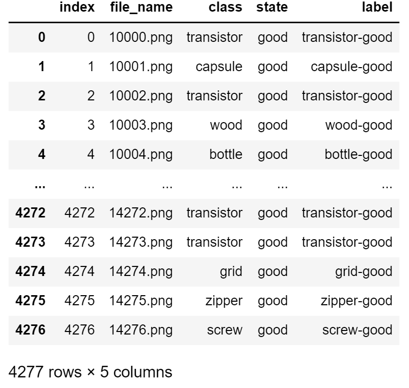

# Computer Vision 이상치 탐지 알고리즘 경진대회

**주최 : 데이콘**

**주관 : 데이콘**

**운영 : 데이콘**

**목적 : 불균형 데이터 셋을 학습하여 사물의 종류를 분류하고 정상과 비정상(이상치) 샘플을 분류하는 AI 모델 개발**

**기간 : 22/04/12 ~ 22/05/13**

**리더보드 :** [https://dacon.io/competitions/official/235894/leaderboard](https://dacon.io/competitions/official/235894/leaderboard)

**URL :** [https://dacon.io/competitions/official/235894/overview/description](https://dacon.io/competitions/official/235894/overview/description)

**Code :** [https://github.com/quhb2455/toy/tree/main/ComputerVision_AnomalyDetection](https://github.com/quhb2455/toy/tree/main/ComputerVision_AnomalyDetection)

# Index

1. [결과](https://www.notion.so/Computer-Vision-03ad88b7ee6e4145a4a4c2d4cf350d54)
2. [EDA](https://www.notion.so/Computer-Vision-03ad88b7ee6e4145a4a4c2d4cf350d54)
3. [사용 모델](https://www.notion.so/Computer-Vision-03ad88b7ee6e4145a4a4c2d4cf350d54)
4. [사용 기법](https://www.notion.so/Computer-Vision-03ad88b7ee6e4145a4a4c2d4cf350d54)
5. [자체 Feedback](https://www.notion.so/Computer-Vision-03ad88b7ee6e4145a4a4c2d4cf350d54)
6. [공부해야할 것들](https://www.notion.so/Computer-Vision-03ad88b7ee6e4145a4a4c2d4cf350d54)

# 결과

---

- Public Score : 전체 테스트 데이터 중 33%
    - 전체 등수 : 66 / 481 (상위 13.7%)
    - 점수 : 0.82363
- Private Score  : 전체 테스트 데이터 중 67%
    - 전체 등수 : 62 / 481 (상위 12.8%)
    - 점수 : 0.82717
- 평가 산식 : Macro - f1
    
    ```python
    from sklearn.metrics import f1_score
    score = f1_score(answer, preds, average='macro')
    ```
    

# EDA

---

```
data
├ sample_submission.csv
├ train.csv
├ test.csv
├ train
	├ 10000.png
	├ 10001.png
	└ 10002.png
		...
└ test
	├ 20000.png
	├ 20001.png
	└ 20002.png
		...
```

## Train Set

### Label Description

- 1개의 Object에 대해서 Class-label과 State-label이 존재함
    
    
    
    - `Class` : 사물의 종류에 대한 정보
    - `State` : 사물의 상태에 대한 정보
    - `Label` : Class와 State를 붙여 놓은 것

### Class-label 별 개수


### State-label 별 개수


### Class-label 별 이미지


### State-label 별 이미지


### 총 평

- 대회 개최 목적과 동일하게 Data imbalance가 굉장히 심함
    - `toothbrush`를 제외하고 모든 데이터는 `good` state가 다른 state-label 보다 월등히 많음
- 데이터 셋 자체가 이미 Augmentation이 적용되어 있는 듯 함
- `leather`, `tile`, `gird`, `wood`, `bottle`, `carpet`, `metal_nut` 등과 같이 Rotation의 영향을 받지 않은 Class가 존재
- Center Align이 되어 있음

## Test Set

### 총 평

- 데이터 셋 자체에 이미 Augmentation이 적용되어 있음
    - Scale, Rotation, Shift 등이 적용되어 있는 듯

# 사용 모델

---

## EfficientNetV2-S

- Inductive Bias가 정확도에 영향을 줄 것이라 판단
- 최근 나온 CNN 모델 중 가장 좋은 성능을 가짐
- 주어진 데이터가 소량이라 Transformer 기반의 모델로는 좋은 성능이 날 것 같지 않았음

## EfficientNetV1-b3

- CNN이 가지는 Inductive Bias가 정확도에 영향을 줄 것이라 판단
- B0와 같은 작은 모델의 경우 데이터의 세세한 부분까지 학습 하지 못할 것이라 판단하여 B3 사용

## CoatNet-Mini

- SOTA 달성 모델이였기 때문에 사용해봄
- Mini 버전의 경우 파라미터 개수도 적어서 학습이 빠를 것이라 판단
- 모델 특성상 CNN과 Attention이 적절히 섞여 있어서 성능이 좋을 것이라 판단

## SwinTransformer

- 이상치 데이터의 Scale이 다양함
- 모델 특성상 작은 Scale 부터 큰 Scale까지의 이상치 부분을 잘 찾아 낼 것이라 판단

# 사용 기법

---

### Data Augmentation

- `Albumentations` 사용
- 주어진 데이터가 상당히 적었고 Imbalance가 심했기 때문에 Off-line Augmentation으로 데이터의 개수 자체를 늘려줌
- 이미지의 색깔을 변경하면 State 구분이 모호해 질 것 같아서 Spatial-level의 Augmentation을 적용함
- Mixup 적용
    - `good` state 이미지를 다른 이상치 state 이미지와 섞음
    - 이 때, Class 별로 다른 Mixup 비율을 설정해줌

### K-fold

- 4 Fold를 적용
- 각 Fold model들을 Ensemble 하고 Soft Voting을 통해서 결과 도출

### Focal Loss 적용

- Data Imbalance 해결을 위해서 Focal Loss 사용
- 데이터의 수가 적고 Confidence scroe가 낮은 Hard example에 집중시키기 위함

### Class 별 Classifier 적용(Multi Classifier)


- 1개의 Classifier가 88개의 Class를 모두 분류하기 힘들 것이라 판단
- 데이터의 개수가 적은 State의 경우 Weight 점유율이 낮을 것이라 판단하여 Class 별로 MLP를 따로 만들어줌
- 총 15개의 MLP 사용

### Multi Input 적용


- Augmented 데이터 셋으로 학습을 진행하여 성능이 좋은 3개의 모델을 Backbone으로 사용
- 각 Backbone에서 나오는 Feature Map들을 Ensemble하여 MLP에 Input으로 줌

# Feedback

---

### 못했던 점

- 학습 중에 어떤 class에 대해서 loss값이 높은지 확인 안함
    - 분명 제대로 찾는거랑 제대로 못찾는게 나뉘어져 있었을텐데 확인 안함
- 맹목적으로 1개의 모델에만 매달림
    - 기본 데이터셋으로 여러 모델을 테스트 후 결정했어야 했는데 그렇지 못함
- Multi MLP처럼 그냥 모델 크기를 늘리는데에만 집중한듯
    - MAE?? 나 FewShot Learning 과 같은 학습 방법이나 모델은 생각하지 못함
- 클래스마다 개수가 부족한 데이터는 aug 개수를 늘려 주던가 했어야 함
- Class 마다 MLP를 따로따로 학습하고 Backbone에 연결 해줬어야 했음
    - Backbone에 15개의 MLP를 연결 시킨 상태에서 학습을 진행하니 성능이 더 떨어졌음
- 최고 점수를 달성하고 난 후에 대회가 끝날 때까지 2주 동안 성능 개선이 없었음
    - 성능이 안나오는 이유를 논리적으로 분석하려고 하지 않았음
    - 그저 데이터를 늘리고 모델을 여러개 사용 하는 방식으로 해결하려고 했음
        - 여러 종류의 모델을 테스트 해보고 Data Augmentation을 다시 해봤어야 했음
    - 정확도가 안나오는 Class에 대한 분석도 필요했음

### 잘했던 점

- 데이터 셋을 확인하고 바로 Augmentation을 진행한 점
- Code를 깔끔하게 짜고 관리한 점
- Augmented 데이터의 버전 관리를 한 점

### 시도해 볼 것

- Hyperparameter 분석 툴을 사용해보기
- 대회를 시작하기 전에 계획을 세워서 어떤 것을 시도해볼지 리스트를 만들기
- 실험 후 결과가 어땠는지 기록 남기고 분석하기

# 공부해야할 것들

---

- CaiT: Going deeper with Image Transformers
- Wandb